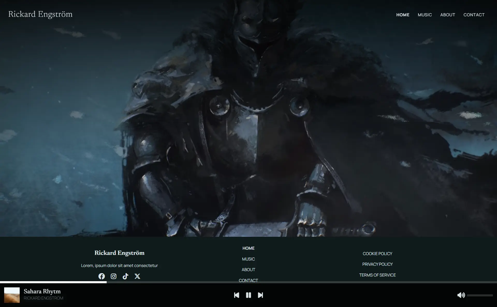

# Music Website (Work in Progress)

A music-focused website currently under development.

## Goals

- Create a modern and visually engaging music website
- Experiment with layout, typography and UI design
- Explore how music conent can be presented on the web
- Use this project as a way for other people to listen to my music

## Features (planned / in progress)

- Responsive layout
- Media and visual content integration
- Custom UI design inspired by music platforms

  ## Tech
  - HTML
  - CSS
  - JavaScript
  - React (not yet)

## Live Demo

https://rickardengstrom.com/

## About the project

This project is an ongoing exploration of building a music website.
The focus is on design, layout and experimenting with different approaches to presenting content.

## What I'm learning

- Designing UI for media heavy websites
- Working with layout and visual hierarchy
- Iterating on design and ideas over time
- Exploring what's possible with JavaScript

## Future Improvements and Features

- Improve and fix the media player
- Add a custom video for each song
- Potentially integrate APIs or backend functionality
- Convert to React
